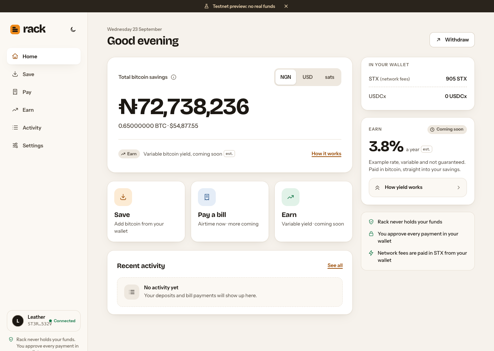
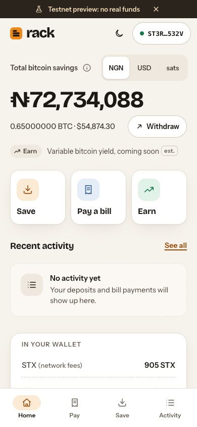
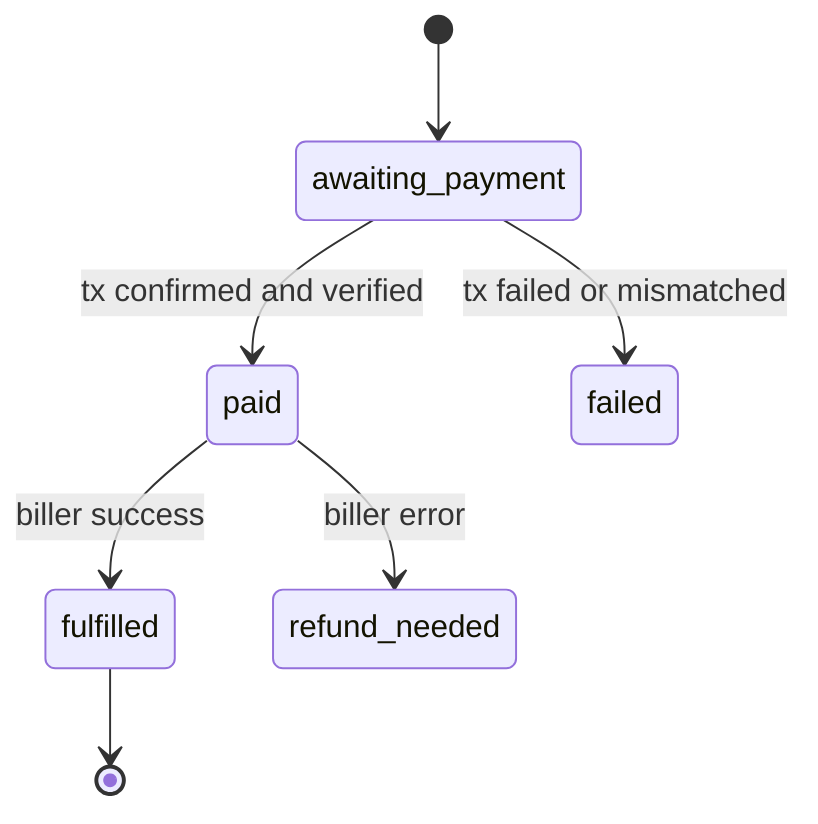
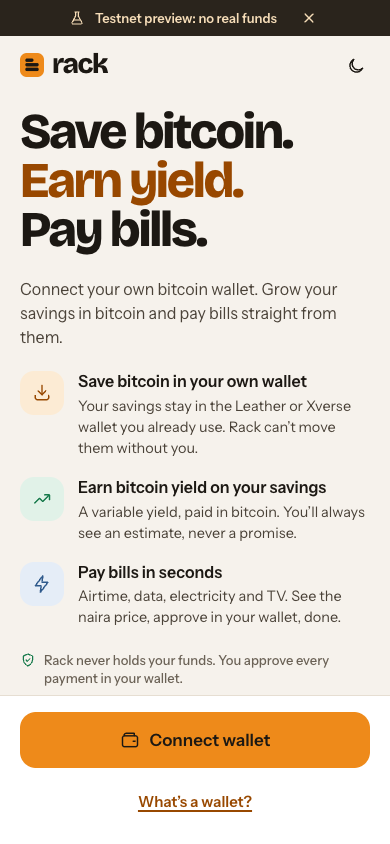
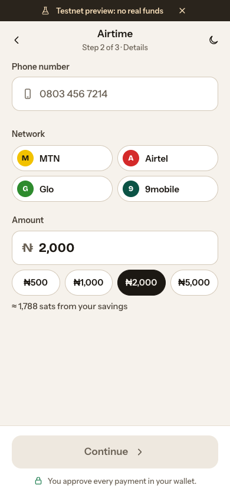
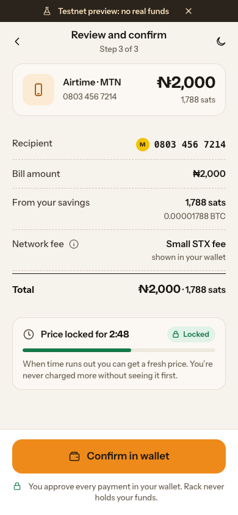
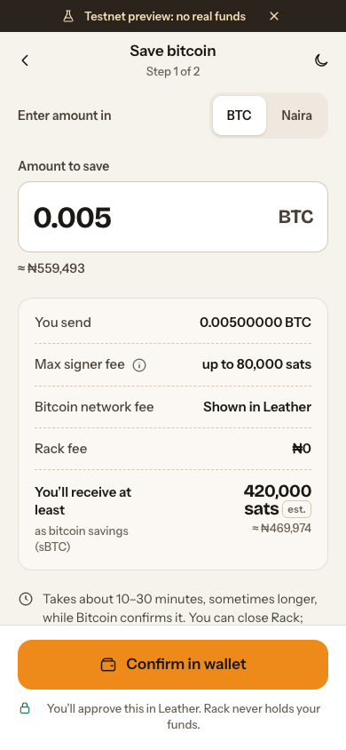
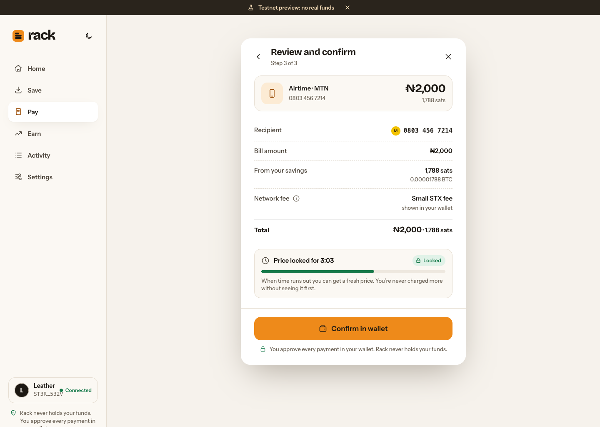
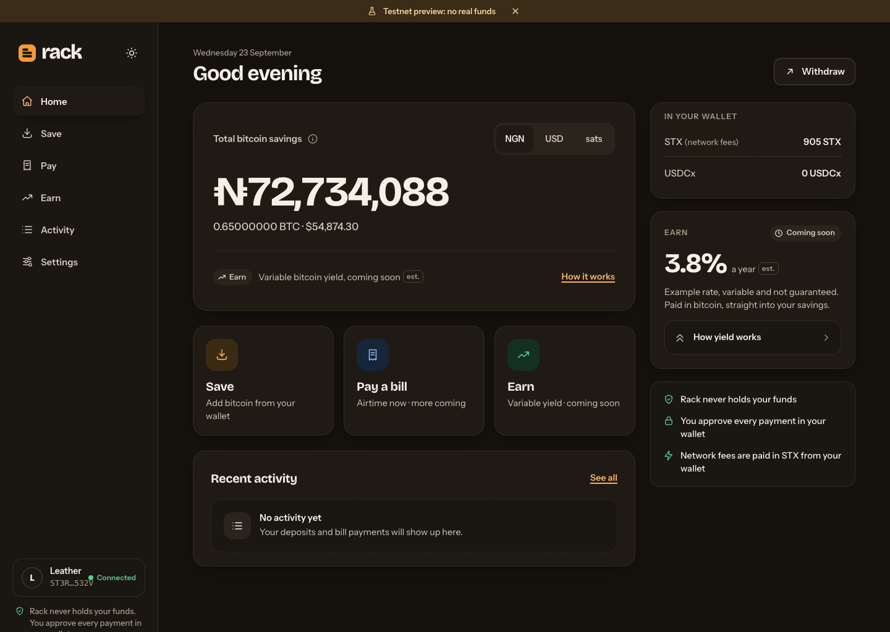
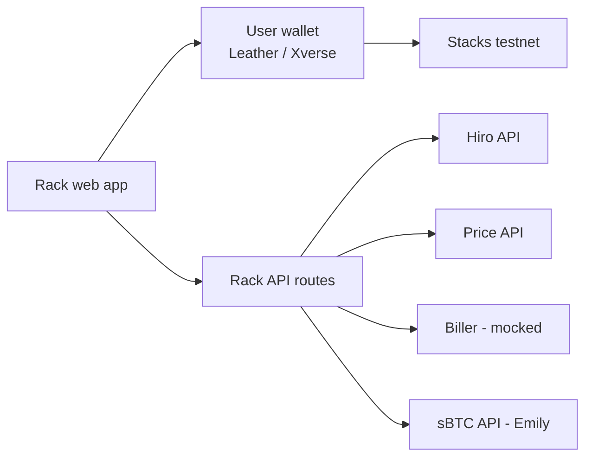

# Rack

**Save bitcoin. Earn yield. Pay bills.**

Rack is a non-custodial bitcoin savings account built on [Stacks](https://stacks.co). You keep your savings as sBTC (bitcoin on Stacks, backed 1:1 by BTC) in your own Leather or Xverse wallet, and pay everyday Nigerian bills straight from them. Every movement of funds is signed in your wallet. Rack never holds your keys or your savings.

This repository is the **testnet MVP** built for a Stacks Endowment *Getting Started* grant application (Q3 2026). The full product spec is in [`docs/PRD.md`](docs/PRD.md).

**Live demo: https://rack-savings.vercel.app** (Stacks testnet)

> **Testnet preview.** No real funds, no real bill payments. The bill-payment partner is mocked.

<p>
  
  
</p>

## Contents

- [Why Rack](#why-rack)
- [What works today](#what-works-today)
- [How an airtime payment is secured](#how-an-airtime-payment-is-secured)
- [Screens](#screens)
- [Architecture](#architecture)
- [Run it locally](#run-it-locally)
- [Configuration](#configuration)
- [API](#api)
- [What is mocked or limited](#what-is-mocked-or-limited)
- [Roadmap](#roadmap)
- [Decisions and open questions](#decisions-and-open-questions)
- [Contributing and issues](#contributing-and-issues)

## Why Rack

Everyday bitcoin holders in Nigeria mostly use a phone, and many hold bitcoin as long-term savings. To pay for airtime, data or electricity today they sell to naira through an exchange: slow, custodial, and it eats into their savings through spreads and fees.

Rack lets them:

1. **Save** in bitcoin without giving it to anyone: savings stay in their own wallet as sBTC.
2. **Earn** a variable, bitcoin-denominated yield on those savings (Dual Stacking, coming in M1).
3. **Pay bills** directly from their bitcoin: see the naira price, approve in the wallet, done.

## What works today

| Flow | Status |
| --- | --- |
| Connect Leather or Xverse (`@stacks/connect` v8), session kept across reloads, disconnect | Working |
| Balances: STX, sBTC and USDCx from the Hiro testnet API, refreshed every 30 s | Working |
| BTC price in NGN and USD, cached 60 s on the server, last-known fallback | Working |
| **Pay airtime:** naira quote → sBTC transfer signed in the wallet → on-chain verification → biller → receipt | Working (biller mocked) |
| Activity: orders and deposits with status chips and explorer links | Working |
| **Save** (BTC → sBTC): personal deposit address from the live signer key, wallet send, Emily notify, step tracker | Works up to signing on testnet ([why](#what-is-mocked-or-limited)) |
| Settings: display currency (NGN / USD / sats), light / dark / system theme, connected wallet, disconnect | Working |
| Earn, withdraw, saved recipients, electricity | UI previews with example values, clearly labelled |
| Responsive web: phone (390 px) to desktop (1440 px), light and dark themes | Working |

## How an airtime payment is secured

1. **Quote.** `POST /api/quotes` validates the Nigerian number (and that the network matches its prefix), the amount (₦100 to ₦50,000), and locks the sats price for **5 minutes**: `sats = ceil(ngn / btcNgn × 100,000,000)`.
2. **Sign.** The wallet is asked to call the sBTC token's SIP-010 `transfer(amount, sender, settlement, memo)`:
   - post-condition mode **Deny**, with exactly one post-condition: *the sender sends exactly the quoted amount of sBTC*;
   - the memo carries the quote id (its 16 raw bytes), so the payment can be matched to the order.
3. **Record.** `POST /api/orders` rejects unknown quotes, expired quotes and a txid already used by another order.
4. **Verify on chain.** The status page polls `GET /api/orders/[id]` every 5 s. An order only becomes `paid` after the server checks, on the Hiro API, that the transaction:
   succeeded · called the sBTC token's `transfer` · came from the quote's sender · went to Rack's settlement address · sent at least the quoted amount · carries the quote id memo.
5. **Fulfil.** The biller tops up the number and returns a reference (`RACK-AT-XXXXXXXX`), or the order is marked `refund_needed`.



## Screens

| Landing | Airtime | Review and confirm | Save |
| --- | --- | --- | --- |
|  |  |  |  |

<p>
  
  
</p>

The UI is a port of the Rack design canvas made in Claude Design: its tokens and component classes live in [`app/globals.css`](app/globals.css). Desktop (≥ 1024 px) uses a left sidebar with flows as centred panels; mobile uses a top bar, a bottom tab bar and a sticky primary button in flows.

## Architecture

One Next.js app holds the web app and a thin API, deployed to Vercel.



The wallet signs everything. The API only issues quotes, verifies transactions on chain and records orders.

| Layer | Choice |
| --- | --- |
| Framework | Next.js 16 (App Router) + TypeScript (strict) |
| Styling | Tailwind CSS v4 + the design's CSS variables, light and dark |
| Wallet | `@stacks/connect` v8 |
| Stacks transactions | `@stacks/transactions` v7 (`Cl`, `Pc` post-conditions) |
| sBTC deposits | `sbtc` package (testnet client, overridden contract) |
| Data fetching | TanStack Query |
| Chain reads | Hiro Stacks API (testnet) |
| Price | CoinGecko simple price (NGN, USD), cached 60 s |
| Order store | JSON file behind a `Store` interface (Postgres in M1) |

```
app/
  (marketing)/page.tsx            landing and wallet connect
  (app)/home | save | pay | pay/airtime | pay/review/[quoteId] | pay/status/[orderId]
       | pay/electricity | earn | withdraw | activity | settings
  api/price | quotes | orders | orders/[id] | deposits | deposits/[id]
components/                       shell (sidebar, tabs, flow panel), StepTracker, StatusChip, ActivityRow…
lib/
  stacks/config.ts                every chain value, from env
  stacks/wallet.ts                connect / disconnect (Leather, Xverse)
  stacks/balances.ts              Hiro balances
  stacks/transfer.ts              sBTC transfer with a Deny-mode post-condition
  stacks/verify.ts                on-chain payment verification
  sbtc/deposit.ts, sbtc/track.ts  BTC → sBTC deposit and Emily status
  biller/mock.ts                  biller adapter (swap for a real partner in M2)
  orders.ts, store.ts, pricing.ts, phone.ts, format.ts
docs/PRD.md                       product requirements
```

## Run it locally

Requires **Node 20+**.

```bash
git clone https://github.com/Evangel90/Rack.git
cd Rack
npm install
cp .env.example .env.local   # then set NEXT_PUBLIC_RACK_SETTLEMENT_ADDRESS
npm run dev                  # http://localhost:3000
```

To make a real testnet payment you need:

1. **Leather** or **Xverse** set to **Testnet**.
2. A little testnet **STX** for network fees and some testnet **sBTC**. Both are available from the [Hiro faucet](https://platform.hiro.so/faucet).
3. A settlement address you control in `NEXT_PUBLIC_RACK_SETTLEMENT_ADDRESS` (it only receives funds, so no key is needed).

Useful scripts:

| Command | What it does |
| --- | --- |
| `npm run dev` | Start the dev server |
| `npm run build` | Production build (type-checks too) |
| `npm run start` | Serve the production build |
| `npm run lint` | ESLint |

### Deploy to Vercel

```bash
npx vercel          # preview
npx vercel --prod   # production (add the env vars in the Vercel project settings first)
```

## Configuration

All chain values come from environment variables (see [`.env.example`](.env.example)); no contract ids are hard-coded in components.

| Variable | Example | Notes |
| --- | --- | --- |
| `NEXT_PUBLIC_STACKS_NETWORK` | `testnet` | |
| `NEXT_PUBLIC_HIRO_API_URL` | `https://api.testnet.hiro.so` | |
| `NEXT_PUBLIC_SBTC_CONTRACT` | `SN3VMHXEN64ZZF71JQ5VESXDWTR301XTTXGF4J8F1.sbtc-token` | Verified on chain 2026-09-23 |
| `NEXT_PUBLIC_SBTC_ASSET` | `sbtc-token` | Fungible-token name inside the contract |
| `NEXT_PUBLIC_USDCX_CONTRACT` | `ST1PQHQKV0RJXZFY1DGX8MNSNYVE3VGZJSRTPGZGM.usdcx` | Leave empty to hide the balance |
| `NEXT_PUBLIC_USDCX_ASSET` | `usdcx-token` | |
| `NEXT_PUBLIC_RACK_SETTLEMENT_ADDRESS` | `ST…` | Receives airtime payments. Receive-only |
| `PRICE_API_URL` | CoinGecko simple price | Must return `{"bitcoin":{"ngn":…,"usd":…}}` |
| `MOCK_BILLER_FAIL_RATE` | `0` | `1` makes every top-up fail, to demo the failure state |
| `NEXT_PUBLIC_SBTC_DEPLOYER` | `SN3VMHX…F1` | Overrides the `sbtc` package's stale testnet default |
| `NEXT_PUBLIC_SBTC_EMILY_URL` | `https://beta.sbtc-emily.com` | sBTC API |
| `NEXT_PUBLIC_SBTC_BTC_NETWORK` | `regtest` | Bitcoin network the sBTC signers watch |
| `SBTC_BTC_API_URL` | *(empty)* | Mempool-style API for that network, used to notify Emily |
| `NEXT_PUBLIC_SBTC_BTC_EXPLORER_URL` | *(empty)* | Bitcoin explorer for deposit links |

> Never put a private key or seed phrase in `.env.local` or the repo.

> The `ST1F7…sbtc-token` id in some docs snippets does not exist on testnet. Use the id above.

## API

| Method and path | Body | Returns |
| --- | --- | --- |
| `GET /api/price` | | `{ btcNgn, btcUsd, updatedAt, stale? }` |
| `POST /api/quotes` | `{ sender, category: "airtime", network, phone, amountNgn, networkOverride? }` | `{ quoteId, amountSats, recipient, expiresAt }` |
| `GET /api/quotes?id=` | | the quote |
| `POST /api/orders` | `{ quoteId, txid }` | `{ orderId, status }` |
| `GET /api/orders/[id]` | | the order, advanced (verified / fulfilled) when possible |
| `GET /api/orders?sender=` | | the sender's orders, newest first |
| `POST /api/deposits` | `{ sender, btcTxid, amountSats, depositAddress, depositScript, reclaimScript }` | the deposit |
| `GET /api/deposits/[id]` | | the deposit, status refreshed from Emily |
| `GET /api/deposits?sender=` | | the sender's deposits, newest first |

## What is mocked or limited

- **Biller.** `lib/biller/mock.ts` waits 1–2 s and returns a reference. No real airtime is sent. The interface matches what a licensed partner adapter needs, so M2 swaps only the implementation.
- **Save on testnet.** Stacks testnet's sBTC runs against a **Bitcoin regtest** network, which Leather and Xverse can't send on. Rack still builds your real deposit address (live signer key, your Stacks address as recipient, 80,000-sat max signer fee, your own key for reclaim) and asks the wallet to send. If it can't, the app shows the deposit address and explains why. Emily notification and status tracking run when `SBTC_BTC_API_URL` is set.
- **Refunds** for `refund_needed` orders are manual during the preview.
- **Order store.** In-memory, mirrored to a JSON file. On Vercel only `/tmp` is writable and it isn't shared between instances, so orders there are best-effort. Postgres replaces it in M1 behind the same interface.
- **Network fees.** Users pay a small STX fee from testnet STX. Sponsored transactions arrive in M1.
- **Earn, withdraw, saved recipients, electricity** are UI previews with example values.

## Roadmap

| Milestone | Scope |
| --- | --- |
| **MVP (this repo)** | Testnet: connect, balances, airtime paid in sBTC with on-chain verification, Save up to signing, Activity, Settings, responsive light/dark UI |
| **M1: Mainnet savings** | Mainnet launch · sponsored transactions (no STX needed) · Postgres · full deposit status and reclaim flow · **withdraw sBTC back to BTC** in the connected wallet · Dual Stacking enrollment for variable bitcoin yield |
| **M2: Real bills** | Data, electricity and TV through a licensed Nigerian bill-payment partner · real airtime · sBTC → USDCx at checkout · saved recipients and one-tap repeat · shareable receipts |
| **M3: More yield** | Optional STX Boost · pooled Bitcoin staking |

Near-term tasks:

- [x] Deploy to Vercel: https://rack-savings.vercel.app
- [ ] Record the 2-minute demo
- [ ] First real testnet sBTC airtime payment, visible in the explorer
- [ ] Test Xverse and Leather end to end on desktop and mobile
- [ ] Persistent order store (Postgres)
- [ ] Automated tests for quote validation and payment verification

## Decisions and open questions

- **Price source:** CoinGecko simple price (keyless, supports NGN), cached 60 s. Swap with `PRICE_API_URL`.
- **Quote lifetime:** 5 minutes, per the PRD (the design mock says 60 s).
- **Network detection:** from the Nigerian number prefix. A mismatch (ported numbers) needs an explicit confirmation.
- **Xverse:** `@stacks/connect` forwards `network: "testnet"` to Xverse's `wallet_connect`, which Xverse doesn't answer, so Rack omits it for Xverse and checks the returned address prefix instead.
- **Open:** which licensed Nigerian bill-payment partner for M2; a name check for "Rack".

## Contributing and issues

Found a bug or have an idea? [Open an issue](https://github.com/Evangel90/Rack/issues).

Rules the code follows (from the PRD): never generate, store or ask for a private key or seed phrase; use post-condition mode Deny on every token-moving call; never mark an order paid from the client's word alone; keep chain config in `lib/stacks/config.ts`.
