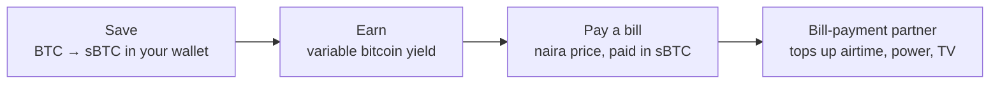

# Rack

**Save bitcoin. Earn yield. Pay bills.**

Rack is a bitcoin savings account for everyday people in Nigeria. You keep your savings in bitcoin, in your own wallet. The savings earn a variable yield paid in bitcoin, and when a bill is due (airtime, data, electricity, TV) you pay it straight from those savings. You see the price in naira, approve in your wallet, and you're done.

Rack is built on [Stacks](https://stacks.co), using sBTC: bitcoin on Stacks, backed 1:1 by BTC. It is **non-custodial**: every movement of funds is signed in the user's own wallet, and Rack never holds keys or savings.

**Live testnet preview: https://rack-savings.vercel.app**

  
  

## The idea

Many Nigerians hold bitcoin as savings: it's how they protect money from a weakening naira. But their daily life is priced in naira. To pay for airtime or electricity they sell bitcoin through an exchange or a peer-to-peer trade, wait for naira to arrive, then pay the bill somewhere else. Every step costs time and fees, and while the money sits on an exchange it isn't theirs.

Rack removes that loop. Savings stay in bitcoin, in the user's wallet, until the moment a bill is paid, and then only the exact amount for that bill leaves.

Three things make it different:

- **Your keys, your savings.** Rack connects to the Leather or Xverse wallet you already use. It can't move funds without your approval, and there's no Rack account holding your bitcoin.
- **Bitcoin that works while it waits.** Savings held as sBTC can earn a variable, bitcoin-denominated yield through Stacks' Dual Stacking. Rack always shows it as an estimate, never a promise.
- **Bills in naira, paid in bitcoin.** Pick the bill, see the naira price and the exact sats, approve, done. The wallet is told to send exactly that amount and nothing more.

## How it works

1. **Save.** Move BTC into savings. It becomes sBTC in your own Stacks wallet, minted by the sBTC signers and redeemable 1:1 for BTC.
2. **Earn.** Savings earn a variable yield in bitcoin, added straight to your balance.
3. **Pay.** Choose a bill and an amount in naira. Rack locks a price in sats for a few minutes, your wallet sends exactly that sBTC, Rack confirms the payment on chain, and a licensed partner delivers the airtime, token or subscription.
4. **Withdraw.** Turn savings back into regular BTC in the Bitcoin address of the wallet you connected, whenever you want.

### Why Stacks and sBTC

- **Bitcoin stays bitcoin.** sBTC is backed 1:1 by BTC, so users save in the asset they trust rather than a new token.
- **Programmable payments.** Stacks post-conditions let the wallet guarantee that a payment sends exactly the quoted amount. That's a protection a regular Bitcoin transaction can't express.
- **Yield in bitcoin.** Dual Stacking pays rewards to sBTC holders, so yield can be earned and paid in bitcoin.
- **Settles to Bitcoin.** Stacks transactions settle to the Bitcoin chain, and the wallets Nigerians already use (Leather, Xverse) support it.

## Where it is today

The testnet preview proves the core loop end to end:

- Connect Leather or Xverse, and see your real sBTC, STX and USDCx balances in naira, dollars or sats.
- Buy airtime: naira quote → exact-amount sBTC payment signed in your wallet → payment verified on chain → receipt. The bill-payment partner is simulated on testnet.
- Start saving: Rack builds your personal sBTC deposit address and hands the transfer to your wallet.
- Activity, settings, light and dark themes, phone to desktop.

Earn, withdraw and more bill types are shown as previews of what's coming. How it's built, how to run it and what's simulated are in [docs/TECHNICAL.md](docs/TECHNICAL.md).

| Landing | Airtime | Review and confirm | Save |
| --- | --- | --- | --- |
|  |  |  |  |

## Road to mainnet

### Milestone 1: mainnet savings

The goal: real people saving real bitcoin in Rack, on Stacks mainnet.

- **Launch on Stacks mainnet** with the mainnet sBTC contract.
- **Save and withdraw, fully.** BTC → sBTC deposits with live status tracking and a reclaim flow if a deposit isn't processed; sBTC → BTC withdrawals, sent only to the Bitcoin address of the connected wallet.
- **Earn for real.** Enroll savings in Dual Stacking and show the variable yield as it's earned.
- **No gas token needed.** Sponsored transactions, so users never have to buy STX to use Rack.
- **Production backend.** A persistent database for orders and deposits, monitoring and alerts on payment verification.
- **Easier onboarding.** An embedded-wallet option for people who don't have Leather or Xverse yet, alongside the existing wallets.

### Milestone 2: real bills

The goal: pay the bills people actually have, straight from bitcoin savings.

- **Licensed bill-payment partner** in Nigeria for airtime, data, electricity (prepaid and postpaid meters) and TV (DStv, GOtv, StarTimes).
- **Stable checkout.** Convert sBTC to USDCx at checkout, so the partner is paid in a stable asset and the user's naira price holds.
- **Automatic refunds** when a partner can't deliver.
- **Everyday conveniences:** saved recipients, one-tap repeat payments and shareable receipts.

### Milestone 3: more yield

- **STX Boost.** Optionally convert a small part of savings to STX and stake it to raise the bitcoin yield on the rest, with the trade-off shown plainly.
- **Pooled Bitcoin staking** for users who want to go further.

### Before real money moves

- Independent review of the payment-verification and deposit flows.
- Clear, plain-language disclosures: yield is variable, STX is not bitcoin, bills depend on the partner.
- Compliance steps required by the bill-payment partner, applied only to the bill-payment side. Savings stay non-custodial.
- A mobile-first launch: the web app already works on a phone, with an installable app to follow.

## Principles

- **Non-custodial, always.** Rack never holds keys or savings. Every payment is approved in the user's wallet.
- **Exact amounts only.** Every payment carries a post-condition that it sends exactly the quoted amount.
- **Verified, not trusted.** A bill is paid only after the payment is confirmed on chain.
- **Honest numbers.** Naira and bitcoin amounts side by side, and yield always labelled "variable" and "est.".
- **Built for phones.** Big tap targets, clear status words, readable contrast, light and dark.

## Open questions

- Which licensed Nigerian bill-payment partner to launch with in Milestone 2.
- How Rack sustains itself: a small spread on bill payments versus a fee on yield, decided before mainnet.
- A trademark and name check for "Rack".

## Links

- Live testnet preview: https://rack-savings.vercel.app
- Technical notes, setup and API: [docs/TECHNICAL.md](docs/TECHNICAL.md)
- Product requirements for the testnet build: [docs/PRD.md](docs/PRD.md)
- Issues and ideas: https://github.com/Evangel90/Rack/issues
