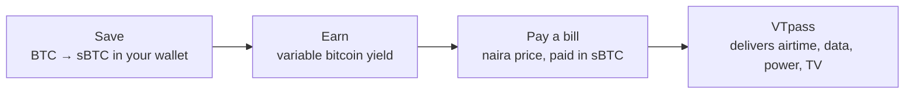
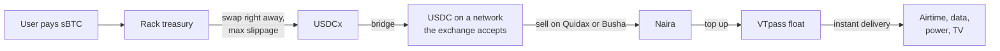

# Rack

**Save bitcoin. Earn yield. Pay bills.**

Rack is a bitcoin savings account for everyday people in Nigeria. You keep your savings in bitcoin, in your own wallet. The savings earn a variable yield paid in bitcoin, and when a bill is due (airtime, data, electricity, TV) you pay it straight from those savings. You see the price in naira, approve in your wallet, and you're done.

Rack is built on [Stacks](https://stacks.co), using sBTC: bitcoin on Stacks, backed 1:1 by BTC. **Savings are non-custodial**: sBTC stays in the user's own wallet, every movement of funds is signed there, and Rack never holds keys or savings. Paying a bill is a purchase: the user sends the exact sBTC price to Rack, the same way they'd pay any merchant.

**Live testnet preview: https://rack-savings.vercel.app**

  
  

## The idea

Many Nigerians hold bitcoin as savings: it's how they protect money from a weakening naira. But their daily life is priced in naira. To pay for airtime or electricity they sell bitcoin through an exchange or a peer-to-peer trade, wait for naira to arrive, then pay the bill somewhere else. Every step costs time and fees, and while the money sits on an exchange it isn't theirs.

Rack removes that loop. Savings stay in bitcoin, in the user's wallet, until the moment a bill is paid, and then only the exact amount for that bill leaves.

Three things make it different:

- **Your keys, your savings.** Rack connects to the Leather or Xverse wallet you already use. It can't move funds without your approval, and there's no Rack account holding your bitcoin.
- **Bitcoin that works while it waits.** Savings held as sBTC can earn a variable, bitcoin-denominated yield through Stacks' Dual Stacking. Rack always shows it as an estimate, never a promise.
- **Bills in naira, paid in bitcoin.** Pick the bill, see the naira price and the exact sats, approve, done. The wallet is told to send exactly that amount and nothing more, and Rack carries the price risk, not the user.

## How it works

1. **Save.** Move BTC into savings. It becomes sBTC in your own Stacks wallet, minted by the sBTC signers and redeemable 1:1 for BTC.
2. **Earn.** Savings earn a variable yield in bitcoin, added straight to your balance.
3. **Pay.** Choose a bill and an amount in naira. Rack locks a price in sats for 60 seconds, your wallet sends exactly that sBTC to Rack's treasury, Rack confirms the payment on chain, and the airtime, data, token or subscription is delivered instantly through VTpass from Rack's pre-funded naira float.
4. **Withdraw.** Turn savings back into regular BTC in the Bitcoin address of the wallet you connected, whenever you want.

### Why Stacks and sBTC

- **Bitcoin stays bitcoin.** sBTC is backed 1:1 by BTC, so users save in the asset they trust rather than a new token.
- **Programmable payments.** Stacks post-conditions let the wallet guarantee that a payment sends exactly the quoted amount. That's a protection a regular Bitcoin transaction can't express.
- **Yield in bitcoin.** Dual Stacking pays rewards to sBTC holders, so yield can be earned and paid in bitcoin.
- **Settles to Bitcoin.** Stacks transactions settle to the Bitcoin chain, and the wallets Nigerians already use (Leather, Xverse) support it.

## Where it is today

The testnet preview proves the core loop end to end:

- Connect Leather or Xverse, and see your real sBTC, STX and USDCx balances in naira, dollars or sats.
- Buy airtime: naira quote → exact-amount sBTC payment signed in your wallet → payment verified on chain → receipt. The bill-payment partner is simulated on testnet.
- Start saving: Rack builds your personal sBTC deposit address and hands the transfer to your wallet.
- Activity, settings, light and dark themes, phone to desktop.

Earn, withdraw and more bill types are shown as previews of what's coming. How it's built, how to run it and what's simulated are in [docs/TECHNICAL.md](docs/TECHNICAL.md).

| Landing | Airtime | Review and confirm | Save |
| --- | --- | --- | --- |
|  |  |  |  |

## How bill payments settle

Rack delivers bills from naira it already holds, so the user never waits for a conversion. Behind the scenes, each sBTC payment is turned back into naira to refill that float.

- **Delivery rail.** Airtime, data, electricity and TV run on [VTpass](https://www.vtpass.com) (Broadshift Technologies) through its API, from a VTpass wallet Rack pre-funds. VTpass has confirmed in writing that its reseller model lets Rack's customers buy through Rack, with transactions processed from Rack's VTpass wallet. Confirmation of API-level integration, and of customers paying Rack in sBTC while Rack settles with VTpass in naira, has been requested. Standard reseller terms cover pilot volume, and VTpass earns commission on each transaction. Flutterwave's developer sandbox is the fallback rail.
- **The float.** ₦1,000,000 (~$728) of working capital sits in Rack's VTpass wallet. It isn't spent: every purchase is repaid in sBTC, converted back to naira and returned to the float.
- **Conversion.** Each sBTC payment is swapped to USDCx on chain as soon as it arrives, with a maximum slippage setting. The USDCx moves to USDC on a network the exchange accepts (for example Ethereum) and is sold for naira on an SEC-registered exchange (Quidax or Busha). The float is topped up when it falls below ₦300,000, or weekly, whichever comes first.
- **The treasury.** A single key controls the treasury address today. It's swept regularly so its balance stays low, and it moves to a multisig as Rack grows.

### Price risk

Rack carries the price risk; the user never does. It's kept small by:

- **Immediate swap to USDCx.** Received sBTC is swapped on arrival, which removes bitcoin price exposure once a payment lands.
- **60-second quotes.** A quote expires after 60 seconds, so the price a user pays is always current.
- **A 1.5% spread** on each quote absorbs small price moves and swap costs.
- **Caps.** ₦50,000 per transaction and ₦100,000 per user per day.
- **Frequent top-ups.** At the threshold or at least weekly, so funds spend little time between USDCx and naira.
- **A low treasury balance**, kept that way by regular sweeps.

## Road to mainnet

Three milestones, delivered within 12 weeks. Scope was cut to fit rather than stretching the schedule.

### Milestone 1: mainnet savings (weeks 1–4)

The goal: real people saving real bitcoin in Rack, on Stacks mainnet.

- **Launch on Stacks mainnet** with the mainnet sBTC contract.
- **Save and withdraw, fully.** BTC → sBTC deposits with live status tracking and a reclaim flow if a deposit isn't processed; sBTC → BTC withdrawals, sent only to the Bitcoin address of the connected wallet.
- **No gas token needed.** Sponsored transactions, so users never have to buy STX to use Rack.
- **Production backend.** A persistent database for orders and deposits, phone verification, and monitoring and alerts on payment verification.

### Milestone 2: real bills (weeks 5–9)

The goal: pay the bills people actually have, straight from bitcoin savings.

- **Airtime, data, electricity and TV** through VTpass.
- **Automatic refunds** when a bill can't be delivered.
- **Treasury conversion.** Received sBTC is swapped to USDCx automatically in Rack's treasury. This used to be planned at checkout; moving it to the treasury keeps checkout a single sBTC payment.

### Milestone 3: yield and a closed pilot (weeks 10–12)

- **Dual Stacking yield.** Enroll savings and show the variable yield as it's earned.
- **STX Boost.** Optionally convert a small part of savings to STX to raise the bitcoin yield on the rest, capped at 10% of savings, with the trade-off shown plainly.
- **A closed pilot** with 25–50 real users.

### After the grant

Pooled Bitcoin staking, saved recipients, one-tap repeat payments and an embedded-wallet option for people without Leather or Xverse.

## Sponsored transactions

Rack pays network fees so users don't need STX. To prevent abuse, it sponsors only an allowlist:

- sBTC transfers to the Rack treasury,
- sBTC withdrawals to the user's own wallet,
- Dual Stacking or STX Boost enrolment.

Anything else is rejected, including sBTC transfers to any other address. Sponsorship also requires a phone-verified account, is capped per wallet per day, is rate-limited by account and IP, and has a daily budget ceiling. After the grant, sponsored gas is paid from the 1.5% spread on bill payments.

## The pilot

- **Who.** 25–50 users recruited through Nigerian bitcoin and Stacks communities such as Let Africa Build and Btrust, plus meetups, content and referrals.
- **Access.** Closed and capped. Each account needs a verified Nigerian phone number, one per account. Limits are ₦50,000 per transaction and ₦100,000 per user per day.
- **What counts.** Only completed bill payments to real phone numbers, meters or smartcards count toward pilot metrics. Wallets funded from the same source are flagged and excluded.
- **Rewards, for real usage only.** A ₦3,000 airtime bonus after three completed bill payments (up to 100 users), and a ₦1,000 referral reward after a referred user's first payment.

## Regulation

Rack doesn't hold a licence today, and it won't rely on a partner's licence for activity Rack performs itself. The Presidential Executive Order on Virtual Assets Coordination, 2026 gives securities-like activity to the SEC, and non-security payment, settlement, custody and related services to the CBN. Rack expects to fall on the CBN side:

- **Savings are non-custodial.** Users hold sBTC in their own wallets, and Rack never controls user funds.
- **Bill pay is a payment service.** Users buy naira-priced airtime and data, paying in sBTC. There's no investment, trading, token issuance or yield product on this flow.
- **Rack doesn't exchange crypto for fiat.** The treasury converts through SEC-registered exchanges (Quidax or Busha), which carry that regulatory responsibility.
- **VTpass only handles naira-side delivery.** It isn't a virtual asset service provider.

During the grant Rack runs only as the closed, capped pilot above. Before public launch, Rack will get a legal opinion confirming this classification and engage the CBN on the appropriate payments authorisation.

## Budget

The grant totals **$8,750**. There are no partner fees.

| | Milestone 1 | Milestone 2 | Milestone 3 |
| --- | ---: | ---: | ---: |
| Build time | $1,350 | $1,375 | $2,500 |
| Hosting and database | $100 | $100 | $100 |
| Sponsored gas | $100 | $150 | $400 |
| Test funds | $100 | $150 | $250 |
| Phone verification (SMS) | $50 | | $50 |
| Monitoring (M1 includes domain) | $50 | | $175 |
| VTpass float (₦1,000,000, revolving) | | $700 | |
| Conversion and transfer fees | | $150 | |
| User acquisition | | | $450 |
| Pilot user incentives | | | $450 |
| **Total** | **$1,750** | **$2,625** | **$4,375** |

User acquisition covers community sessions, content and promotion in Nigerian bitcoin and Stacks communities. Pilot incentives are the usage-based rewards above.

## Before real money moves

- Independent review of the payment-verification and deposit flows.
- Clear, plain-language disclosures: yield is variable, STX is not bitcoin, bill delivery depends on VTpass.
- A legal opinion on Rack's classification, and engagement with the CBN, before public launch.
- A mobile-first launch: the web app already works on a phone, with an installable app to follow.

## Principles

- **Non-custodial savings.** Rack never holds keys or savings. Every payment is approved in the user's wallet.
- **Exact amounts only.** Every payment carries a post-condition that it sends exactly the quoted amount.
- **Verified, not trusted.** A bill is paid only after the payment is confirmed on chain.
- **Rack carries the risk.** The naira price the user sees is the price they pay; price moves after that are Rack's problem.
- **Honest numbers.** Naira and bitcoin amounts side by side, and yield always labelled "variable" and "est.".
- **Built for phones.** Big tap targets, clear status words, readable contrast, light and dark.

## Open questions

- VTpass's written confirmation of API-level integration and sBTC-in, naira-out settlement (requested, awaiting reply).
- A trademark and name check for "Rack".

## Links

- Live testnet preview: https://rack-savings.vercel.app
- Technical notes, setup and API: [docs/TECHNICAL.md](docs/TECHNICAL.md)
- Product requirements for the testnet build: [docs/PRD.md](docs/PRD.md)
- Issues and ideas: https://github.com/Evangel90/Rack/issues

## License

Rack is released under the [MIT License](LICENSE).
