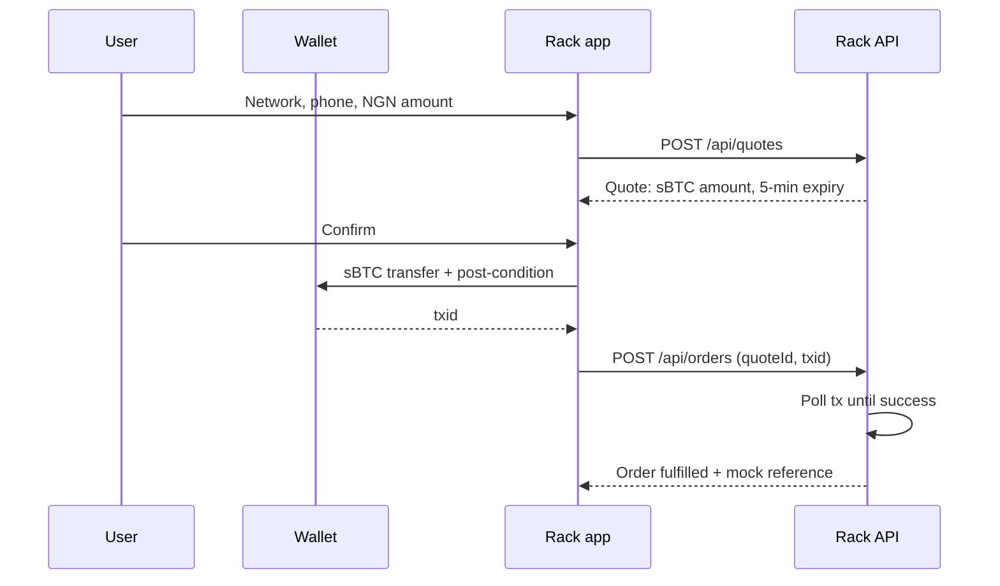
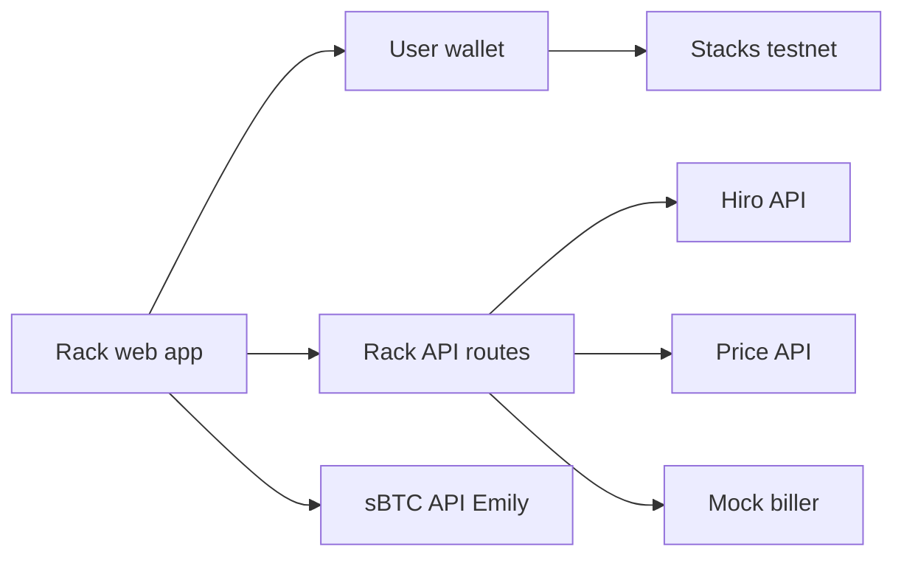
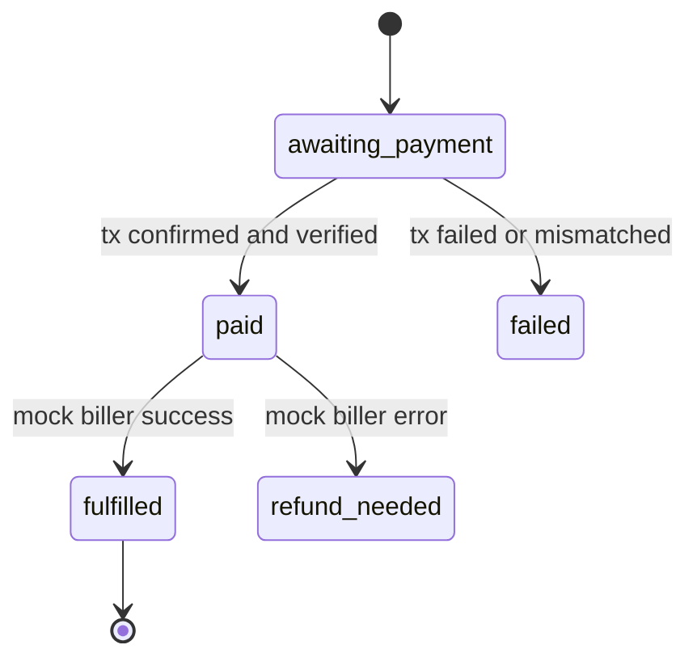

# Rack — PRD (Testnet MVP)

Sep 23, 2026

## Overview

Rack is a non-custodial Bitcoin savings account that earns yield and pays everyday bills, built on Stacks. Tagline: **Save bitcoin. Earn yield. Pay bills.**

This PRD covers a testnet MVP, built in one night, that proves the core flows work for a Stacks Endowment Getting Started grant application (Q3 2026 cycle).

**Goals of this MVP**

- A reviewer can open a live URL, connect a Stacks wallet on testnet, and see their sBTC, STX and USDCx balances.
- A user can start a BTC to sBTC deposit from their own wallet (the Save flow).
- A user can buy airtime end to end: quote in naira, sign an sBTC transfer in their wallet, see a receipt. The biller partner is mocked.
- The UI is responsive and clean on desktop (1440px) and mobile web (390px).

**Success criteria**

- Deployed on Vercel with a public URL and a public GitHub repo with a README.
- At least one real testnet sBTC transfer for an airtime order, visible in the Stacks testnet explorer.
- A 2-minute demo video recorded from the live app.
- Rack never takes custody of user savings: every fund movement is signed in the user's wallet.

## Scope

Tonight's build is testnet only and optimises for a working demo, not production. Anything not in the "In scope" column is out.

| Area | In scope tonight | Later milestone |
| --- | --- | --- |
| Network | Stacks testnet | Mainnet (M1) |
| Wallet | Leather and Xverse via @stacks/connect | Embedded wallet option |
| Save | Build and sign the BTC to sBTC deposit with the `sbtc` package, show status | Full status polling, reclaim flow UI (M1) |
| Pay | Airtime only, paid with an sBTC transfer to a settlement address, mocked biller | Data, electricity, TV via a licensed partner; sBTC to USDCx at checkout (M2) |
| Earn | Static explainer screen | Dual Stacking enrollment (M1), STX boost and pooled Bitcoin Staking (M3) |
| Gas | User pays STX fee from testnet faucet | Sponsored transactions (M1) |
| Data | In-memory or JSON file store for orders | Postgres (M1) |
| Auth | Wallet address is the identity | Same |

**Non-goals for tonight**

- No real bill payments, real money, or real partner integrations.
- No KYC, no accounts, no email or phone login.
- No custody: the backend never holds user keys or savings balances.
- No native mobile app. Responsive web only.

## Users and core flows

The user is an everyday bitcoin holder in Nigeria who is not a crypto expert and mostly uses a phone. Five flows make up the MVP.

**1. Connect.** User lands on the landing page, taps Connect wallet, approves in Leather or Xverse, and lands on Home. Disconnect is in Settings.

**2. Save (BTC to sBTC).**

1. User enters an amount in BTC (naira equivalent shown).
2. App shows the max signer fee and the estimated sBTC received.
3. App builds the deposit transaction with the `sbtc` package, targeting the user's own Stacks address.
4. User signs and broadcasts from their own Bitcoin wallet.
5. App notifies the sBTC API (Emily) and shows a step tracker: Sent, Confirming on Bitcoin, Minting sBTC, Done.

**3. Pay a bill (airtime).**



The post-condition guarantees the user sends exactly the quoted sBTC amount and nothing else. The backend only marks an order paid after it confirms the transaction on chain, from the right sender, to the settlement address, for at least the quoted amount.

**4. Earn.** A static screen explaining variable bitcoin-denominated yield through Dual Stacking and the optional STX boost, labelled "Coming soon". No numbers presented as guaranteed.

**5. Activity.** A list of the user's airtime orders and deposits started in this app, with status chips and explorer links.

## Screens and UX requirements

Follow the designs from Claude Design or Stitch where they exist; where they don't, follow these requirements. Build the Pay flow and Home first, since they carry the demo.

| Route | Screen | Must have |
| --- | --- | --- |
| `/` | Landing | Rack wordmark, tagline as headline, 3 benefit points, Connect wallet button. Redirect to `/home` if connected |
| `/home` | Home | Total savings in NGN (sBTC amount under it), STX and USDCx balances, quick actions Save / Pay a bill / Earn, last 5 activity items |
| `/save` | Save | Amount input, fee and receive estimate, Deposit button, step tracker after signing |
| `/pay` | Bill categories | Cards: Airtime (active), Data, Electricity, TV ("Coming soon") |
| `/pay/airtime` | Airtime form | Network chips MTN / Airtel / Glo / 9mobile, phone input (Nigerian format, auto-detect network by prefix), amount presets ₦500 / ₦1,000 / ₦2,000 / ₦5,000 + custom |
| `/pay/review/[quoteId]` | Review | Recipient, NGN amount, sBTC amount, fee line, 5-minute countdown, Confirm in wallet |
| `/pay/status/[orderId]` | Status and receipt | Pending, success (reference + explorer link), failed (next step) |
| `/earn` | Earn | Static explainer, "Coming soon" badge |
| `/activity` | Activity | Orders and deposits, status chips, explorer links |
| `/settings` | Settings | Display currency NGN / USD / sats, connected address with copy, Disconnect |

**Layout**

- Desktop (≥ 1024px): left sidebar with Rack wordmark and nav, content max-width 1100px, flows as centred panels.
- Mobile (< 1024px): top bar with wordmark, bottom tab bar (Home, Pay, Save, Activity), sticky primary button at the bottom of flows.
- A thin dismissible banner on every screen: "Testnet preview: no real funds".

**States and copy rules**

- Every async action has loading (skeletons for balances), pending, success and error states.
- Show NGN and the bitcoin amount side by side for every money value.
- Say "bitcoin savings" in main UI. Keep sBTC, STX and Stacks in helper text and tooltips.
- Never write "interest" or a guaranteed rate. Yield copy says "variable" and "est.".
- Show "You approve every payment in your wallet" near every confirm button.
- WCAG AA contrast, 44px minimum tap targets, status never shown by colour alone.

## Tech stack and architecture

One Next.js app holds both the frontend and a thin API, deployed to Vercel. Keep it to one repo and one deploy tonight.

| Layer | Choice |
| --- | --- |
| Framework | Next.js (App Router) + TypeScript |
| Styling | Tailwind CSS, light and dark theme via CSS variables |
| Wallet | `@stacks/connect` (Leather, Xverse) |
| Stacks transactions | `@stacks/transactions`, `@stacks/network` |
| sBTC deposits | `sbtc` (testnet client) |
| Data fetching | TanStack Query for balances, prices and order polling |
| API | Next.js route handlers under `app/api/` |
| Order store | JSON file or in-memory map behind a `store.ts` interface, so Postgres can replace it later |
| Chain reads | Hiro Stacks API (testnet) |
| Price | BTC/NGN from a public price API, cached 60 seconds server-side |
| Hosting | Vercel |



The wallet signs everything. The API only issues quotes, verifies transactions on chain and records orders.

**Folder structure**

```
rack/
  app/
    (marketing)/page.tsx        # landing
    (app)/layout.tsx            # sidebar + bottom tabs
    (app)/home/page.tsx
    (app)/save/page.tsx
    (app)/pay/page.tsx
    (app)/pay/airtime/page.tsx
    (app)/pay/review/[quoteId]/page.tsx
    (app)/pay/status/[orderId]/page.tsx
    (app)/earn/page.tsx
    (app)/activity/page.tsx
    (app)/settings/page.tsx
    api/price/route.ts
    api/quotes/route.ts
    api/orders/route.ts
    api/orders/[id]/route.ts
  components/                   # ui primitives, AmountDisplay, StepTracker, StatusChip
  lib/
    stacks/config.ts            # network, contract ids
    stacks/wallet.ts            # connect, disconnect, address
    stacks/balances.ts
    stacks/transfer.ts          # sBTC transfer with post-condition
    sbtc/deposit.ts
    biller/mock.ts
    store.ts
    pricing.ts
  .env.local
```

## Stacks integration

All chain values live in `lib/stacks/config.ts` and come from env vars. The agent must confirm testnet contract ids and current library APIs in the official docs before coding against them; Stacks.js APIs changed across recent major versions, so never guess a function signature.

**Wallet**

- Use `@stacks/connect` to connect, read the user's Stacks (STX) and Bitcoin addresses, and disconnect.
- Persist the connected address client-side; the address is the user's identity in the API.

**Balances**

- Read from the Hiro testnet API `GET /extended/v1/address/{stxAddress}/balances`.
- STX: `stx.balance` (micro-STX, 6 decimals).
- sBTC and USDCx: the `fungible_tokens` entries keyed by `<contract>::<asset>`. sBTC uses 8 decimals (1 sBTC = 1 BTC = 100,000,000 sats).
- Refetch every 30 seconds and after any confirmed transaction.

**Airtime payment: sBTC transfer**

- Call the sBTC token's SIP-010 `transfer(amount, sender, recipient, memo)` through the wallet.
- `recipient` = `RACK_SETTLEMENT_ADDRESS` (a testnet address Rack controls, receiving payment for the service).
- `memo` = the quote id as a buffer (max 34 bytes), so the backend can match the payment to the order.
- Post-condition mode **Deny**, with exactly one post-condition: the sender sends exactly the quoted amount of the sBTC token.
- Show the Stacks testnet explorer link for the txid: `https://explorer.hiro.so/txid/<txid>?chain=testnet`.

**Save: BTC to sBTC deposit**

1. Create `SbtcApiClientTestnet`, fetch the signers' public key.
2. Build the deposit address with `buildSbtcDepositAddress`, using the user's Stacks address as the mint recipient and the default max signer fee (80,000 sats).
3. Ask the wallet to send the chosen BTC amount to that address.
4. Call `notifySbtc` with the txid and the deposit and reclaim scripts.
5. Poll the deposit status and drive the step tracker.

Stacks testnet sBTC runs against Bitcoin regtest, so test BTC may be hard to get. Fallback: build the deposit address and show the full flow up to the signing step, and label it clearly in the UI and README.

**Pricing**

- sBTC is 1:1 with BTC. `sats = ceil(ngnAmount / btcNgnPrice × 100,000,000)`.
- Quotes lock the sats amount for 5 minutes. Expired quotes are rejected and the UI asks for a new quote.

## Backend

The API issues quotes, verifies payments on chain and fulfils orders through a mock biller. It never signs transactions for users and never holds their keys.

**Endpoints**

| Method and path | Body | Returns |
| --- | --- | --- |
| `GET /api/price` | none | `{ btcNgn, btcUsd, updatedAt }` |
| `POST /api/quotes` | `{ sender, category: "airtime", network, phone, amountNgn }` | `{ quoteId, amountSats, recipient, expiresAt }` |
| `POST /api/orders` | `{ quoteId, txid }` | `{ orderId, status }` |
| `GET /api/orders/[id]` | none | full order, polled by the status page every 5 seconds |
| `GET /api/orders?sender=` | none | the sender's orders, newest first |

**Validation**

- Phone: Nigerian mobile number, normalised to `234XXXXXXXXXX`; the network must match the prefix, or the user confirms the override.
- Amount: ₦100 to ₦50,000 per order.
- `POST /api/orders` rejects expired quotes, unknown quotes, and a txid already used by another order.

**Order data model**

| Field | Type |
| --- | --- |
| `id` | string (uuid) |
| `quoteId` | string |
| `sender` | Stacks address |
| `category` | `"airtime"` |
| `network` | `"mtn" \| "airtel" \| "glo" \| "9mobile"` |
| `phone` | string |
| `amountNgn` | number |
| `amountSats` | number |
| `txid` | string |
| `status` | see state diagram |
| `reference` | string, set on fulfilment |
| `failureReason` | string, optional |
| `createdAt`, `updatedAt` | ISO timestamps |

**Order states**



Verification before `paid`: the transaction succeeded on chain, called the sBTC token's `transfer`, the sender matches the quote, the recipient is the settlement address, the amount is at least `amountSats`, and the memo matches the quote id.

**Mock biller**

`lib/biller/mock.ts` exposes `purchaseAirtime({ network, phone, amountNgn })`. It waits 1 to 2 seconds and returns a reference like `RACK-AT-<8 chars>`. An env flag `MOCK_BILLER_FAIL_RATE` (default 0) lets the demo show the failure state. Keep the interface identical to what a real partner adapter will need, so M2 only swaps the implementation.

## Setup and commands

Every command lists the directory it runs in. Run them in order.

1. **Create the app.** In `~/Desktop`:

   ```
   npx create-next-app@latest rack --typescript --tailwind --app --eslint
   ```
2. **Install dependencies.** In `~/Desktop/rack`:

   ```
   npm install @stacks/connect @stacks/transactions @stacks/network sbtc @tanstack/react-query
   ```
3. **Create the env file.** In `~/Desktop/rack`, create `.env.local` with the variables in the table below.
4. **Run locally.** In `~/Desktop/rack`:

   ```
   npm run dev
   ```

   Open http://localhost:3000.
5. **Initialise git and push.** In `~/Desktop/rack`, after creating an empty public `Rack` repo on GitHub under Evangel90:

   ```
   git add .
   git commit -m "Rack testnet MVP"
   git branch -M main
   git remote add origin https://github.com/Evangel90/Rack.git
   git push -u origin main
   ```
6. **Deploy.** In `~/Desktop/rack`:

   ```
   npx vercel
   npx vercel --prod
   ```

   Add the same env vars in the Vercel project settings before the production deploy.

**Environment variables**

| Name | Example | Notes |
| --- | --- | --- |
| `NEXT_PUBLIC_STACKS_NETWORK` | `testnet` |  |
| `NEXT_PUBLIC_HIRO_API_URL` | `https://api.testnet.hiro.so` |  |
| `NEXT_PUBLIC_SBTC_CONTRACT` | `<testnet address>.sbtc-token` | Confirm in the sBTC docs |
| `NEXT_PUBLIC_USDCX_CONTRACT` | `<testnet address>.usdcx` | Confirm in the USDCx docs; hide the balance if unavailable |
| `NEXT_PUBLIC_RACK_SETTLEMENT_ADDRESS` | `ST...` | A fresh testnet address you control |
| `PRICE_API_URL` | provider URL | BTC/NGN price source |
| `MOCK_BILLER_FAIL_RATE` | `0` | Set to `1` to demo failure |

Never put a private key or mnemonic in `.env.local` or the repo. The settlement address only receives funds, so the app needs no key for it.

## Build order

Build in this order and stop after each task to run the app and check its acceptance criteria. If time runs short, tasks 1 to 6 plus 9 are the minimum demo.

- [ ] **1. Shell and layout.** App routes, sidebar (desktop), bottom tabs (mobile), testnet banner, theme tokens. *Done when:* every route renders at 1440px and 390px with no horizontal scroll.
- [ ] **2. Wallet connect.** Landing, connect, disconnect, route guard. *Done when:* connecting in Leather or Xverse lands on `/home` with the address shown, and a refresh keeps the session.
- [ ] **3. Balances and price.** `/api/price`, balances hook, Home hero in NGN with sBTC under it. *Done when:* balances match the Hiro explorer for the connected testnet address, with skeletons while loading.
- [ ] **4. Quote API and airtime form.** Validation, network prefix detection, amount presets, `POST /api/quotes`. *Done when:* a valid form returns a quote and the review page shows it with a working 5-minute countdown.
- [ ] **5. sBTC transfer.** Contract call with Deny-mode post-condition and quote-id memo. *Done when:* confirming opens the wallet with the exact amount, and the txid appears in the testnet explorer.
- [ ] **6. Order verification and fulfilment.** `POST /api/orders`, on-chain verification, mock biller, status page polling. *Done when:* an order moves awaiting\_payment → paid → fulfilled and the receipt shows the reference, and a tampered or expired order is rejected.
- [ ] **7. Activity.** Order list for the connected address. *Done when:* past orders show with status chips and explorer links.
- [ ] **8. Save flow.** Deposit address, wallet BTC send, `notifySbtc`, step tracker. *Done when:* the flow runs up to signing on testnet, or completes if test BTC is available.
- [ ] **9. Earn, Settings, README.** Static Earn page, Settings, README with problem, architecture, testnet addresses, what is mocked, roadmap. *Done when:* the README lets a reviewer understand and run the app in 5 minutes.
- [ ] **10. Deploy and demo.** Vercel production deploy, record a 2-minute demo. *Done when:* the live URL works from a phone.

## Risks, open questions and agent rules

The biggest risk tonight is time: protect tasks 1 to 6 and cut the Save flow to its fallback if needed.

**Risks**

| Risk | Fallback |
| --- | --- |
| No test BTC on the regtest network Stacks testnet uses | Show the Save flow up to signing, label it in UI and README |
| No testnet sBTC in the demo wallet | Check the Stacks docs and Discord for a testnet sBTC faucet before building task 5 |
| USDCx testnet contract unavailable | Hide the USDCx balance, keep it in the roadmap |
| Stacks.js API differs from this PRD | Follow the current official docs; the PRD describes behaviour, not signatures |
| Price API rate limits | Cache server-side for 60 seconds, show last known price with its timestamp |

**Open questions**

- [ ] Which BTC/NGN price source to use for the MVP?
- [ ] Which licensed Nigerian bill-payment partner to approach for M2?
- [ ] Is "Rack" free of conflicts with existing finance apps?

**Rules for the coding agent**

- Never generate, store, log or ask for a private key or seed phrase. All signing happens in the user's wallet.
- Use post-condition mode Deny on every contract call that moves tokens.
- Never mark an order paid from the client's word alone; verify on chain.
- Keep chain config in `lib/stacks/config.ts`; no hard-coded contract ids in components.
- Don't add features outside the Scope table. If something is ambiguous, pick the simplest option and note it in the README.
- Use TypeScript strict mode and keep components small. Commit after each build-order task.
