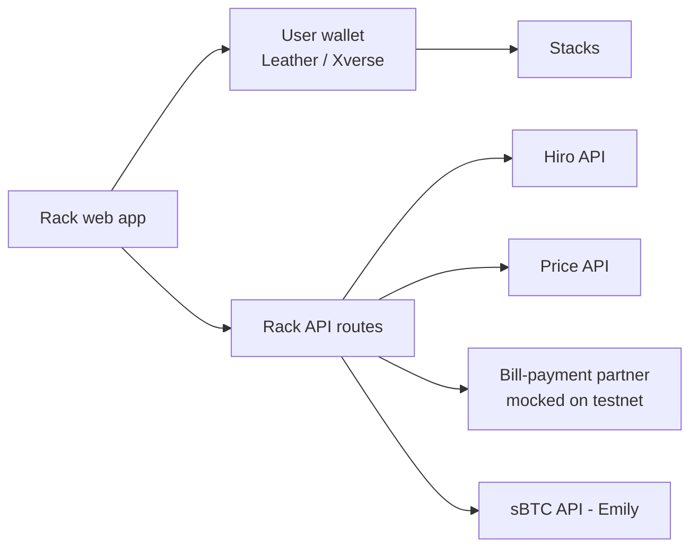
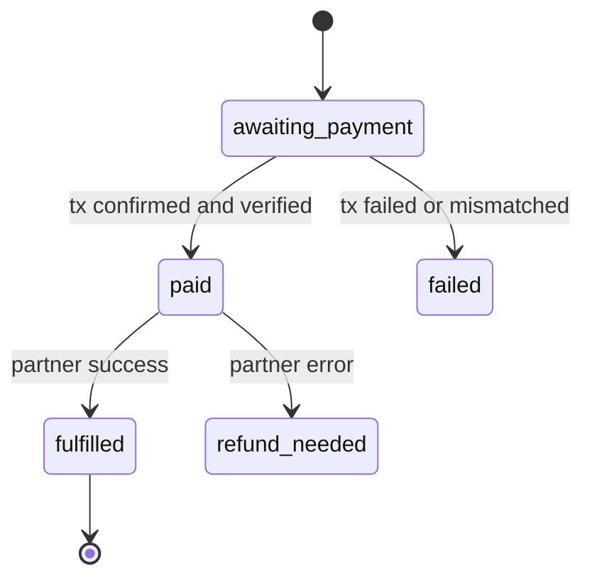

# Rack: technical notes

How the testnet build works, how to run it, and what is mocked. For the product idea and the mainnet plan, see the [README](../README.md).

## Architecture

One Next.js app holds the web app and a thin API, deployed to Vercel.



The wallet signs everything. The API only issues quotes, verifies transactions on chain and records orders. It never signs for users and never holds keys.

| Layer | Choice |
| --- | --- |
| Framework | Next.js 16 (App Router) + TypeScript (strict) |
| Styling | Tailwind CSS v4 + design tokens as CSS variables, light and dark |
| Wallet | `@stacks/connect` v8 (Leather, Xverse) |
| Stacks transactions | `@stacks/transactions` v7 (`Cl` values, `Pc` post-conditions) |
| sBTC deposits | `sbtc` package |
| Data fetching | TanStack Query |
| Chain reads | Hiro Stacks API |
| Price | CoinGecko simple price (NGN, USD), cached 60 s server-side |
| Order store | JSON file behind a `Store` interface (Postgres on mainnet) |

### Folder layout

```
app/
  (marketing)/page.tsx            landing and wallet connect
  (app)/home | save | pay | pay/airtime | pay/review/[quoteId] | pay/status/[orderId]
       | pay/electricity | earn | withdraw | activity | settings
  api/price | quotes | orders | orders/[id] | deposits | deposits/[id]
components/                       shell (sidebar, tabs, flow panel), StepTracker, StatusChip, ActivityRow…
lib/
  stacks/config.ts                every chain value, from env
  stacks/wallet.ts                connect / disconnect
  stacks/balances.ts              Hiro balances
  stacks/transfer.ts              sBTC transfer with a Deny-mode post-condition
  stacks/verify.ts                on-chain payment verification
  sbtc/deposit.ts, sbtc/track.ts  BTC → sBTC deposit and Emily status
  biller/mock.ts                  bill-payment adapter (mock on testnet)
  orders.ts, store.ts, pricing.ts, phone.ts, format.ts, links.ts
```

## How a bill payment is secured

1. **Quote.** `POST /api/quotes` validates the Nigerian number (and that the network matches its prefix), the amount (₦100 to ₦50,000), and locks the sats price for 5 minutes: `sats = ceil(ngn / btcNgn × 100,000,000)`.
2. **Sign.** The wallet calls the sBTC token's SIP-010 `transfer(amount, sender, settlement, memo)` with post-condition mode **Deny** and exactly one post-condition: the sender sends exactly the quoted amount of sBTC. The memo carries the quote id (16 raw bytes).
3. **Record.** `POST /api/orders` rejects unknown quotes, expired quotes and a txid already used by another order.
4. **Verify on chain.** The status page polls `GET /api/orders/[id]` every 5 s. An order becomes `paid` only after the server confirms on the Hiro API that the transaction succeeded, called the sBTC token's `transfer`, came from the quote's sender, went to the settlement address, sent at least the quoted amount, and carries the quote id memo.
5. **Fulfil.** The bill-payment adapter tops up the number and returns a reference, or the order is marked `refund_needed`.



## Saving (BTC → sBTC)

1. Fetch the signers' aggregate public key from `sbtc-registry`.
2. Build a personal deposit address with `buildSbtcDepositAddress`: the user's Stacks address as mint recipient, an 80,000-sat max signer fee, and the user's own Bitcoin key (x-only) as the reclaim key.
3. Ask the wallet to send BTC to that address (`sendTransfer`).
4. Notify Emily with the transaction and scripts, then poll its status to drive the step tracker (sent → confirming → minting → done).

## Run it locally

Requires Node 20+.

```bash
git clone https://github.com/Evangel90/Rack.git
cd Rack
npm install
cp .env.example .env.local   # then set NEXT_PUBLIC_RACK_SETTLEMENT_ADDRESS
npm run dev                  # http://localhost:3000
```

To make a testnet payment you need Leather or Xverse on **Testnet**, a little testnet STX for fees and some testnet sBTC (both from the [Hiro faucet](https://platform.hiro.so/faucet)), and a settlement address you control. The settlement address must be a different account from the one that pays.

| Command | What it does |
| --- | --- |
| `npm run dev` | Start the dev server |
| `npm run build` | Production build (type-checks too) |
| `npm run start` | Serve the production build |
| `npm run lint` | ESLint |

Deploy with `npx vercel` (preview) and `npx vercel --prod` after adding the env vars to the Vercel project.

## Configuration

All chain values come from environment variables (see [`.env.example`](../.env.example)).

| Variable | Example | Notes |
| --- | --- | --- |
| `NEXT_PUBLIC_STACKS_NETWORK` | `testnet` | |
| `NEXT_PUBLIC_HIRO_API_URL` | `https://api.testnet.hiro.so` | |
| `NEXT_PUBLIC_SBTC_CONTRACT` | `SN3VMHXEN64ZZF71JQ5VESXDWTR301XTTXGF4J8F1.sbtc-token` | Testnet sBTC token |
| `NEXT_PUBLIC_SBTC_ASSET` | `sbtc-token` | Fungible-token name in the contract |
| `NEXT_PUBLIC_USDCX_CONTRACT` | `ST1PQHQKV0RJXZFY1DGX8MNSNYVE3VGZJSRTPGZGM.usdcx` | Leave empty to hide the balance |
| `NEXT_PUBLIC_USDCX_ASSET` | `usdcx-token` | |
| `NEXT_PUBLIC_RACK_SETTLEMENT_ADDRESS` | `ST…` | Receives bill payments. Receive-only |
| `PRICE_API_URL` | CoinGecko simple price | Must return `{"bitcoin":{"ngn":…,"usd":…}}` |
| `MOCK_BILLER_FAIL_RATE` | `0` | `1` makes every top-up fail, to demo the failure state |
| `NEXT_PUBLIC_SBTC_DEPLOYER` | `SN3VMHX…F1` | Overrides the `sbtc` package's outdated testnet default |
| `NEXT_PUBLIC_SBTC_EMILY_URL` | `https://beta.sbtc-emily.com` | sBTC API |
| `NEXT_PUBLIC_SBTC_BTC_NETWORK` | `regtest` | Bitcoin network the sBTC signers watch |
| `SBTC_BTC_API_URL` | *(empty)* | Mempool-style API for that network, used to notify Emily |
| `NEXT_PUBLIC_SBTC_BTC_EXPLORER_URL` | *(empty)* | Bitcoin explorer for deposit links |

Never put a private key or seed phrase in `.env.local` or the repo. The `ST1F7…sbtc-token` id in some docs snippets does not exist on testnet.

## API

| Method and path | Body | Returns |
| --- | --- | --- |
| `GET /api/price` | | `{ btcNgn, btcUsd, updatedAt, stale? }` |
| `POST /api/quotes` | `{ sender, category: "airtime", network, phone, amountNgn, networkOverride? }` | `{ quoteId, amountSats, recipient, expiresAt }` |
| `GET /api/quotes?id=` | | the quote |
| `POST /api/orders` | `{ quoteId, txid }` | `{ orderId, status }` |
| `GET /api/orders/[id]` | | the order, advanced when possible |
| `GET /api/orders?sender=` | | the sender's orders, newest first |
| `POST /api/deposits` | `{ sender, btcTxid, amountSats, depositAddress, depositScript, reclaimScript }` | the deposit |
| `GET /api/deposits/[id]` | | the deposit, status refreshed from Emily |
| `GET /api/deposits?sender=` | | the sender's deposits, newest first |

## What is mocked or limited on testnet

- **Bill payments** go through `lib/biller/mock.ts`: it waits 1–2 s and returns a reference. No real airtime is sent. A licensed partner adapter replaces it with the same interface.
- **Saving** works up to signing. Stacks testnet's sBTC runs against a Bitcoin regtest network that Leather and Xverse can't send on, so the app shows the real deposit address and explains why when the wallet can't send.
- **Refunds** for `refund_needed` orders are manual.
- **Orders** are kept in memory and a JSON file. On Vercel that file lives in `/tmp` and isn't shared between instances.
- **Network fees** are paid by the user in testnet STX.
- **Earn, withdraw, saved recipients and electricity** are UI previews with example values.
- **Xverse:** `@stacks/connect` forwards `network: "testnet"` to Xverse's `wallet_connect`, which Xverse doesn't answer, so the app omits it for Xverse and checks the returned address prefix instead.

## Rules the code follows

- Never generate, store, log or ask for a private key or seed phrase. All signing happens in the user's wallet.
- Post-condition mode Deny on every contract call that moves tokens.
- Never mark an order paid from the client's word alone; verify on chain.
- Chain config lives in `lib/stacks/config.ts`; no hard-coded contract ids in components.
